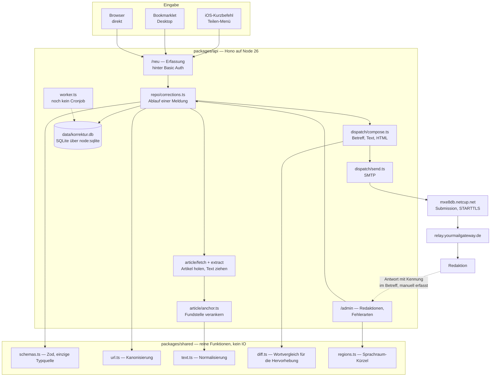
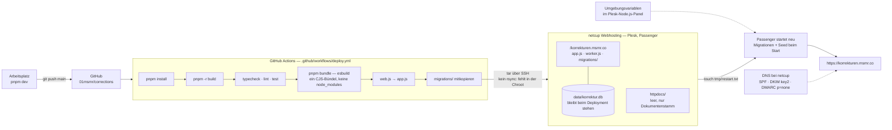

# Aufbau und Deployment

Zwei Diagramme: wie eine Meldung durch die Anwendung läuft, und wie der Code auf
den Server kommt. Beides beschreibt den Stand, nicht die Absicht — was hier steht,
existiert.

## Aufbau

Der Rückweg ist bewusst gestrichelt: Einen automatischen Abruf der Antworten gibt
es nicht. Die Kennung im Betreff (`compose.ts`) ist die Zuordnungshilfe beim
Nachtragen von Hand.

## Deployment

Zwei Eigenheiten dieser Umgebung, die man kennen muss:

- **Kein `rsync`** in netcups Chroot — der Upload läuft deshalb über `tar` durch
  eine SSH-Verbindung. `tmp/` ist ausgenommen, weil `pnpm bundle` ein leeres
  `build/tmp` anlegt und sonst Passengers Arbeitsverzeichnis überschriebe.
- **Kein sichtbares Anwendungslog.** Passenger leitet die Ausgabe des
  Node-Prozesses nirgendwohin, was aus der Chroot erreichbar wäre. Fehler beim
  Versand sind deshalb nur über den Datensatz selbst zu diagnostizieren, nicht
  über `console.error`.

## Ergänzungen (Stand 5. August 2026)

Seit den Diagrammen oben dazugekommen:

- **Öffentliche Startseite** unter `/` („In eigener Sache", Rubriken „In eigener
  Sache" und „Aus der Werkstatt", zweispaltig). Die Wurzel leitet nicht mehr auf
  das Formular; die Mail-Fußzeile verweist hierher.
- **Formular-Endpunkte** hinter der Basic-Auth (`/neu/*`):
  `POST /neu/vorschau` (Mail-Vorschau ohne Nebenwirkung, Platzhalter-Kennung
  VORSCHAU, echter Versand erst über den Sendeknopf der Vorschau),
  `POST /neu/kategorie` (automatische Kategorie- und Schwere-Erkennung,
  `shared/detect.ts`), `POST /neu/ueberschrift` (holt den Artikeltitel, sobald
  die URL im Formular steht), `POST /admin/fehlerarten/reihenfolge` (ziehbare
  Sortierung, Zehnerschritte).
- **Eine Palette für alles:** `PALETTE`/`PALETTE_DUNKEL` in
  `packages/shared/src/constants.ts`. Oberfläche (CSS-Variablen und data-URIs in
  `layout.tsx`) und Mail (Inline-Stile in `compose.ts`) fragen dieselben Werte
  ab; ein Test pinnt fest, dass in der Mail nichts literal bleibt.
- **Mail als Zeitungskommentar** (`compose.ts`): Titelzeile, Untertitel-Band,
  Rubrik „Korrektur", Schlagzeile, Serifen-Fließtext, Fassungen als Blöcke mit
  farbiger Kante in Courier — nur Inline-Stile und überall vorhandene Schriften.
- **Wortwelt:** Ressorts „In eigener Sache · Neue Korrektur · Titel ·
  Kategorien"; das Versandobjekt heißt Hinweis, sein Token Kennung; Schwere
  leicht/mittel/schwer. Fehlerarten sind die flache Liste des
  ursprünglichen Kurzbefehls plus Ergänzungen.
- **Geplant, noch nicht gebaut:** die öffentliche Statistik-Seite „Bilanz"
  (Route + Ansicht; Kennzahlen-Views und `repo/stats.ts` liegen bereit; Regeln:
  Quoten nie ohne n, alphabetisch, kein Ranking). Offen außerdem: der
  Worker-Cronjob in Plesk und der verwaiste alte Deploy-Schlüssel in
  `authorized_keys`.

## Ergänzungen (Stand 6. August 2026)

### Bilanz — die öffentliche Statistik steht

`GET /bilanz` (öffentlich, fünftes Ressort). Zahlen kommen aus `repo/bilanz.ts`,
die Ansicht aus `views/bilanz.tsx`:

- **Eckdaten** (Korrekturen, Medien, Zeitraum), **beide Leitquoten**,
  **Verteilung** nach Fehlerart und Schwere, **Zeitreihe je Monat**,
  **Medien-Tabelle** und der Abschnitt „Was diese Zahlen nicht sagen".
- **Zwei Regeln tragen die Ehrlichkeit der Seite:** Eine Korrektur ohne
  Artikel-Prüfung zählt nicht in den Korrektur-Nenner (sie ist *ungeprüft*, nicht
  *nicht korrigiert*), und ohne gelaufenen Postfach-Abgleich bleibt der
  Antwort-Nenner leer. Sonst behauptete die Seite bei frischem Bestand „0 %" —
  eine Aussage über uns, ausgegeben als Aussage über die Redaktionen.
- Monate ohne Korrektur werden in der Zeitreihe mit Null gefüllt, damit die Achse
  keinen gleichmäßigen Verlauf vortäuscht.
- Tabellen lassen sich per Klick auf den Spaltenkopf umsortieren (Zahlenspalten
  beim ersten Klick absteigend). Die Serverantwort bleibt alphabetisch, die
  Voreinstellung stellt also keine Rangfolge auf.

### Altbestand (P4) — Werkzeuge fertig, Import läuft

Eigenes Paket `packages/backfill`, getrennt vom Serverpfad; gemeinsam mit dem
Dauerbetrieb nur `packages/shared`.

- `pnpm backfill:korpus` — Gesendet-Ordner einmalig read-only als `.eml` nach
  `fixtures.local/korpus` (1328 Mails).
- `pnpm backfill:review` — Review-Queue auf **:3223**, ein Bildschirm pro Meldung,
  `Enter` übernehmen / `E` bearbeiten / `X` verwerfen. **Jederzeit unterbrechbar:**
  jede Entscheidung geht sofort nach `fixtures.local/review-entscheidungen.jsonl`,
  der Neustart überspringt Entschiedenes.
- `pnpm backfill:import` bzw. **`/admin/backfill`** — spielt die Entscheidungen
  ein (`source='backfill'`, idempotent über die Message-ID). Die Adminseite ist
  nötig, weil die SSH-Chroot des Hosters **keine Node-Laufzeit** hat.
- Der Vorlagen-Parser liest die Kurzbefehl-Mails konservativ: 85 % sicher, der
  Rest zur Prüfung oder verworfen — geraten wird nie.

### Fehlerarten mit Anzahl und Zeichen

Eine Kategorie, freie Anzahl: `corrections.error_count` und `error_char`. Die
Erkennung zählt mit (`detectErrorCount`, `detectErrorChar`), `benenneFehlerart`
in `shared` fügt es sprachlich zusammen — „ein Zeichen fehlt", „zwei Wörter zu
viel", „ein Komma zu viel". Zahlwörter bis zwölf, darüber Ziffern.

### Medien-Stammdaten

`packages/api/src/db/medien.json` — die Redaktionsnamen und Korrekturadressen aus
dem Wörterbuch des Kurzbefehls (`RedNAME`/`RedMAIL`), beim Start übernommen
(`tools/medienStammdaten.ts`): anlegen, was fehlt, aktualisieren, was abweicht.
Sie schlägt aus Altmails abgeleitete Adressen, weil sie auch Medien ohne Meldung
kennt und Adresswechsel bereits enthält.

### Domains

Ein archiviertes Medium gibt seine Domains frei — sonst blockierte es sie
unsichtbar. Wandert eine Domain zu einem anderen Medium, folgen ihr die
bisherigen Korrekturen (zugeordnet über den Host der kanonischen Artikel-URL);
geholt wird nur von archivierten Medien. Zusatzdomains lassen sich entfernen,
ohne dass Korrekturen verloren gehen; die letzte Domain bleibt stehen.

### Farben

Auszeichnungsfarbe ist Kirschrot `#bb2233` (dunkel `#e07b86`), Schwarz für
Schatten als `PALETTE.schatten`. **Eine Lint-Regel verbietet Farbliterale**
außerhalb von `constants.ts` — der Deploy bricht sonst ab.

### Offen

P3 (Antwort-Zuordnung per IMAP) und P5 (Artikel-Prüfungen per Cronjob) — solange
sie fehlen, bleiben beide Quoten der Bilanz leer. Außerdem weiter offen: der
Worker-Cronjob in Plesk und der verwaiste Deploy-Schlüssel in `authorized_keys`.

## Ergänzungen (Stand 12. August 2026)

### Meldungshistorie (`/admin/meldungen`)

Nummerierte, filterbare Liste aller Meldungen samt Detailseite und dem
ersten Schreiber des `outcome`-Felds (Plan
`docs/superpowers/plans/2026-08-13-meldungshistorie.md`).

- **Nummern** entstehen per `ROW_NUMBER()` über den ungefilterten
  Gesamtbestand (`COALESCE(sent_at, created_at), id`) und bleiben beim
  Filtern stehen — Filter erzeugen Lücken, keine Umnummerierung.
- **Ausgänge:** `open` (ohne Rückmeldung), `acknowledged`, `corrected`,
  `corrected_other` (anders korrigiert), `rejected` (als richtig benannt).
  `corrected_other` kam ohne Migration hinzu — SQLite kennt die Enum nicht
  als Constraint. `no_response` ist Altlast, nur noch lesbar.
- **Nicht öffentlich, in der Tiefe verteidigt:** Der Router trägt seine
  eigene `adminAuth`-Schicht zusätzlich zur `/admin/*`-Verdrahtung in
  app.ts, begrenzt auf die eigenen Pfade (ein `use("*")` sperrte an der
  Wurzel montiert die ganze Seite). Ein Test montiert ihn ohne die äußere
  Schicht und erwartet 401; alle Antworten tragen `Cache-Control: no-store`.
- **Detail** rendert Falsch/Richtig über `fassungenHtml` aus
  `dispatch/compose.ts` — dieselbe Quelle wie die Mail (Fehlstelle hell auf
  Karmin/Grün, umgebender Teilsatz fett), kein Nachbau.

### Layout der Meldungsliste

Scroll-Reihenfolge wie im Blatt: erst zieht der Zeitungstitel davon, der
klebende Kopf bleibt, die Filterzeile klebt bündig darunter; unten stehen
Blätterreihe und Fußzeile fest, dazwischen läuft allein die Liste.

- Drei gemessene Höhen als CSS-Variablen (`--kopfhoehe`, `--fusshoehe`,
  `--leistehoehe`), gesetzt per ResizeObserver **nach** `DOMContentLoaded`
  — das Skript steht im Markup vor der Fußzeile; wer sie sofort suchte,
  fände nichts (gelernt aus einer echten Überdeckung).
- Blätterreihe in drei Höhenlagen des Bleisatzes: erhaben (Ziel),
  eingedrückt (aktive Seite, kein Link), flach auf z = 0 (ziel-loses
  zurück/vor). Der Innenrand der Reihe muss Hub (7px) und Kanten (5px)
  der Klötze einschließen, sonst blitzen Zeilen um die Knöpfe durch.
- **Schmal (≤ 48 rem):** Breite Tabellen (Medien, Kategorien, Meldungen)
  liegen in einem Quer-Scroller (`.querblatt`) — die Tabelle scrollt IN
  der Seite, nie die Seite selbst; auf der Meldungsliste wandern
  Filterzeile und Tabelle gemeinsam. Der Scroller wird erst schmal zum
  Scroll-Container, weil er sonst das Kleben der Filterzeile am Desktop
  bräche. Die unteren Leisten laufen schmal randlos über die volle
  Breite, sonst zöge Inhalt durch die seitlichen Streifen.

### Antwort-Zuordnung (P3, Worker)

Ein Gang durch den Posteingang (`inbox/postfach.ts`, Erkennung rein in
`inbox/antworten.ts`, Schreiben in `repo/antworten.ts`):

1. Eingangsbestätigungen → Papierkorb, zählen nicht als Antwort.
2. Zuordnung, der sicherste Weg zuerst: Kennung `[K…]` am Betreffende →
   Faden (`In-Reply-To` gegen unsere `message_id`) → **Titel**: die alten
   Meldungen trugen den Artikeltitel als Betreff; der Weg gilt nur bei
   genau einem Treffer UND passender Absender-Domain (Subdomains zählen).
3. `response_event` idempotent über die Message-ID; `open` →
   `acknowledged` mit Mail-Datum, ein gesetzter Ausgang bleibt unberührt.

Gelesen wird ab dem UID-Cursor (`imap_cursor`): der erste Lauf sieht das
ganze Postfach und holt die Alt-Antworten herein. Wechselt die
UIDVALIDITY, beginnt der nächste Lauf von vorn — gefahrlos, weil das
Vermerken idempotent ist. Voraussetzung im Betrieb: `IMAP_*` in Plesk und
der stündliche Worker-Cron.

### Sitzung nach Basic Auth

Nach der ersten erfolgreichen Anmeldung setzt `adminAuth` ein
Sitzungs-Cookie (90 Tage): HMAC über die Zugangsdaten — nicht erratbar,
absichtlich deterministisch, ein Passwortwechsel macht alle Sitzungen
ungültig, gespeichert wird nichts. iOS-Safari vergisst Basic-Auth-Zugänge
sonst notorisch schnell.
