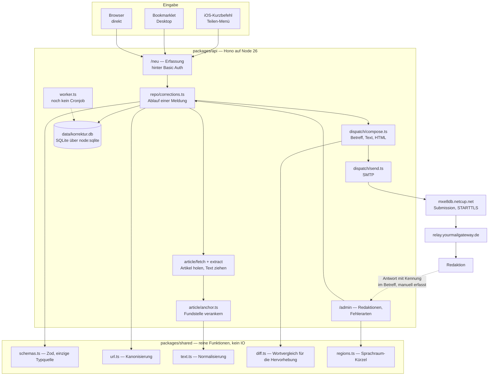
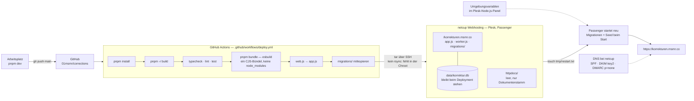

# Aufbau und Deployment

Zwei Diagramme: wie eine Meldung durch die Anwendung läuft, und wie der Code auf
den Server kommt. Beides beschreibt den Stand, nicht die Absicht — was hier steht,
existiert.

## Aufbau

Der Rückweg ist bewusst gestrichelt: Einen automatischen Abruf der Antworten gibt
es nicht. Die Kennung im Betreff (`compose.ts`) ist die Zuordnungshilfe beim
Nachtragen von Hand.

## Deployment

Zwei Eigenheiten dieser Umgebung, die man kennen muss:

- **Kein `rsync`** in netcups Chroot — der Upload läuft deshalb über `tar` durch
  eine SSH-Verbindung. `tmp/` ist ausgenommen, weil `pnpm bundle` ein leeres
  `build/tmp` anlegt und sonst Passengers Arbeitsverzeichnis überschriebe.
- **Kein sichtbares Anwendungslog.** Passenger leitet die Ausgabe des
  Node-Prozesses nirgendwohin, was aus der Chroot erreichbar wäre. Fehler beim
  Versand sind deshalb nur über den Datensatz selbst zu diagnostizieren, nicht
  über `console.error`.
