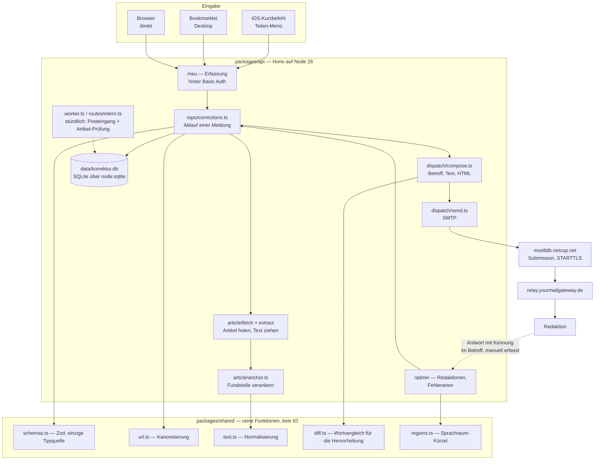
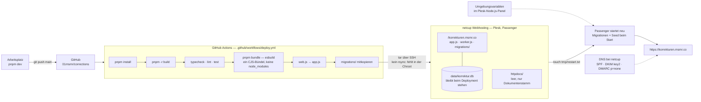

# Aufbau und Deployment

Zwei Diagramme: wie eine Meldung durch die Anwendung läuft, und wie der Code auf
den Server kommt. Beides beschreibt den Stand, nicht die Absicht — was hier steht,
existiert.

## Aufbau

Der Rückweg ist bewusst gestrichelt: Einen automatischen Abruf der Antworten gibt
es nicht. Die Kennung im Betreff (`compose.ts`) ist die Zuordnungshilfe beim
Nachtragen von Hand.

## Deployment

Zwei Eigenheiten dieser Umgebung, die man kennen muss:

- **Kein `rsync`** in netcups Chroot — der Upload läuft deshalb über `tar` durch
  eine SSH-Verbindung. `tmp/` ist ausgenommen, weil `pnpm bundle` ein leeres
  `build/tmp` anlegt und sonst Passengers Arbeitsverzeichnis überschriebe.
- **Kein sichtbares Anwendungslog.** Passenger leitet die Ausgabe des
  Node-Prozesses nirgendwohin, was aus der Chroot erreichbar wäre. Fehler beim
  Versand sind deshalb nur über den Datensatz selbst zu diagnostizieren, nicht
  über `console.error`.

## Ergänzungen (Stand 5. August 2026)

Seit den Diagrammen oben dazugekommen:

- **Öffentliche Startseite** unter `/` („In eigener Sache", Rubriken „In eigener
  Sache" und „Aus der Werkstatt", zweispaltig). Die Wurzel leitet nicht mehr auf
  das Formular; die Mail-Fußzeile verweist hierher.
- **Formular-Endpunkte** hinter der Basic-Auth (`/neu/*`):
  `POST /neu/vorschau` (Mail-Vorschau ohne Nebenwirkung, Platzhalter-Kennung
  VORSCHAU, echter Versand erst über den Sendeknopf der Vorschau),
  `POST /neu/kategorie` (automatische Kategorie- und Schwere-Erkennung,
  `shared/detect.ts`), `POST /neu/ueberschrift` (holt den Artikeltitel, sobald
  die URL im Formular steht), `POST /admin/fehlerarten/reihenfolge` (ziehbare
  Sortierung, Zehnerschritte).
- **Eine Palette für alles:** `PALETTE`/`PALETTE_DUNKEL` in
  `packages/shared/src/constants.ts`. Oberfläche (CSS-Variablen und data-URIs in
  `layout.tsx`) und Mail (Inline-Stile in `compose.ts`) fragen dieselben Werte
  ab; ein Test pinnt fest, dass in der Mail nichts literal bleibt.
- **Mail als Zeitungskommentar** (`compose.ts`): Titelzeile, Untertitel-Band,
  Rubrik „Korrektur", Schlagzeile, Serifen-Fließtext, Fassungen als Blöcke mit
  farbiger Kante in Courier — nur Inline-Stile und überall vorhandene Schriften.
- **Wortwelt:** Ressorts „In eigener Sache · Neue Korrektur · Titel ·
  Kategorien"; das Versandobjekt heißt Hinweis, sein Token Kennung; Schwere
  leicht/mittel/schwer. Fehlerarten sind die flache Liste des
  ursprünglichen Kurzbefehls plus Ergänzungen.
- **Geplant, noch nicht gebaut:** die öffentliche Statistik-Seite „Bilanz"
  (Route + Ansicht; Kennzahlen-Views und `repo/stats.ts` liegen bereit; Regeln:
  Quoten nie ohne n, alphabetisch, kein Ranking). Offen außerdem der
  verwaiste alte Deploy-Schlüssel in `authorized_keys`.

## Ergänzungen (Stand 6. August 2026)

### Bilanz — die öffentliche Statistik steht

`GET /bilanz` (öffentlich, fünftes Ressort). Zahlen kommen aus `repo/bilanz.ts`,
die Ansicht aus `views/bilanz.tsx`:

- **Eckdaten** (Korrekturen, Medien, Zeitraum), **beide Leitquoten**,
  **Verteilung** nach Fehlerart und Schwere, **Zeitreihe je Monat**,
  **Medien-Tabelle** und der Abschnitt „Was diese Zahlen nicht sagen".
- **Zwei Regeln tragen die Ehrlichkeit der Seite:** Eine Korrektur ohne
  Artikel-Prüfung zählt nicht in den Korrektur-Nenner (sie ist *ungeprüft*, nicht
  *nicht korrigiert*), und ohne gelaufenen Postfach-Abgleich bleibt der
  Antwort-Nenner leer. Sonst behauptete die Seite bei frischem Bestand „0 %" —
  eine Aussage über uns, ausgegeben als Aussage über die Redaktionen.
- Monate ohne Korrektur werden in der Zeitreihe mit Null gefüllt, damit die Achse
  keinen gleichmäßigen Verlauf vortäuscht.
- Tabellen lassen sich per Klick auf den Spaltenkopf umsortieren (Zahlenspalten
  beim ersten Klick absteigend). Die Serverantwort bleibt alphabetisch, die
  Voreinstellung stellt also keine Rangfolge auf.

### Altbestand (P4) — Werkzeuge fertig, Import läuft

Eigenes Paket `packages/backfill`, getrennt vom Serverpfad; gemeinsam mit dem
Dauerbetrieb nur `packages/shared`.

- `pnpm backfill:korpus` — Gesendet-Ordner einmalig read-only als `.eml` nach
  `fixtures.local/korpus` (1328 Mails).
- `pnpm backfill:review` — Review-Queue auf **:3223**, ein Bildschirm pro Meldung,
  `Enter` übernehmen / `E` bearbeiten / `X` verwerfen. **Jederzeit unterbrechbar:**
  jede Entscheidung geht sofort nach `fixtures.local/review-entscheidungen.jsonl`,
  der Neustart überspringt Entschiedenes.
- `pnpm backfill:import` bzw. **`/admin/backfill`** — spielt die Entscheidungen
  ein (`source='backfill'`, idempotent über die Message-ID). Die Adminseite ist
  nötig, weil die SSH-Chroot des Hosters **keine Node-Laufzeit** hat.
- Der Vorlagen-Parser liest die Kurzbefehl-Mails konservativ: 85 % sicher, der
  Rest zur Prüfung oder verworfen — geraten wird nie.

### Fehlerarten mit Anzahl und Zeichen

Eine Kategorie, freie Anzahl: `corrections.error_count` und `error_char`. Die
Erkennung zählt mit (`detectErrorCount`, `detectErrorChar`), `benenneFehlerart`
in `shared` fügt es sprachlich zusammen — „ein Zeichen fehlt", „zwei Wörter zu
viel", „ein Komma zu viel". Zahlwörter bis zwölf, darüber Ziffern.

### Medien-Stammdaten

`packages/api/src/db/medien.json` — die Redaktionsnamen und Korrekturadressen aus
dem Wörterbuch des Kurzbefehls (`RedNAME`/`RedMAIL`), beim Start übernommen
(`tools/medienStammdaten.ts`): anlegen, was fehlt, aktualisieren, was abweicht.
Sie schlägt aus Altmails abgeleitete Adressen, weil sie auch Medien ohne Meldung
kennt und Adresswechsel bereits enthält.

### Domains

Ein archiviertes Medium gibt seine Domains frei — sonst blockierte es sie
unsichtbar. Wandert eine Domain zu einem anderen Medium, folgen ihr die
bisherigen Korrekturen (zugeordnet über den Host der kanonischen Artikel-URL);
geholt wird nur von archivierten Medien. Zusatzdomains lassen sich entfernen,
ohne dass Korrekturen verloren gehen; die letzte Domain bleibt stehen.

### Farben

Auszeichnungsfarbe ist Kirschrot `#bb2233` (dunkel `#e07b86`), Schwarz für
Schatten als `PALETTE.schatten`. **Eine Lint-Regel verbietet Farbliterale**
außerhalb von `constants.ts` — der Deploy bricht sonst ab. Seit dem
16.8.2026 gilt dasselbe für die Abstufungen und alle Maße (siehe „Maße als
Skalen").

### Offen

P3 (Antwort-Zuordnung) und P5 (Artikel-Prüfung) sind seit dem 14.8.2026 in
Betrieb, beide am selben stündlichen Anstoß. Weiter offen: der verwaiste
Deploy-Schlüssel in `authorized_keys`.

## Ergänzungen (Stand 12. August 2026)

### Meldungshistorie (`/admin/meldungen`)

Nummerierte, filterbare Liste aller Meldungen samt Detailseite und dem
ersten Schreiber des `outcome`-Felds (Plan
`docs/superpowers/plans/2026-08-13-meldungshistorie.md`).

- **Nummern** entstehen per `ROW_NUMBER()` über den ungefilterten
  Gesamtbestand (`COALESCE(sent_at, created_at), id`) und bleiben beim
  Filtern stehen — Filter erzeugen Lücken, keine Umnummerierung.
- **Ausgänge:** `open` (ohne Rückmeldung), `acknowledged`, `corrected`,
  `corrected_other` (anders korrigiert), `rejected` (als richtig benannt).
  `corrected_other` kam ohne Migration hinzu — SQLite kennt die Enum nicht
  als Constraint. `no_response` ist Altlast, nur noch lesbar.
- **Nicht öffentlich, in der Tiefe verteidigt:** Der Router trägt seine
  eigene `adminAuth`-Schicht zusätzlich zur `/admin/*`-Verdrahtung in
  app.ts, begrenzt auf die eigenen Pfade (ein `use("*")` sperrte an der
  Wurzel montiert die ganze Seite). Ein Test montiert ihn ohne die äußere
  Schicht und erwartet 401; alle Antworten tragen `Cache-Control: no-store`.
- **Detail** rendert Falsch/Richtig über `fassungenHtml` aus
  `dispatch/compose.ts` — dieselbe Quelle wie die Mail (Fehlstelle hell auf
  Karmin/Grün, umgebender Teilsatz fett), kein Nachbau.

### Layout der Meldungsliste

Scroll-Reihenfolge wie im Blatt: erst zieht der Zeitungstitel davon, der
klebende Kopf bleibt, die Filterzeile klebt bündig darunter; unten stehen
Blätterreihe und Fußzeile fest, dazwischen läuft allein die Liste.

- Drei gemessene Höhen als CSS-Variablen (`--kopfhoehe`, `--fusshoehe`,
  `--leistehoehe`), gesetzt per ResizeObserver **nach** `DOMContentLoaded`
  — das Skript steht im Markup vor der Fußzeile; wer sie sofort suchte,
  fände nichts (gelernt aus einer echten Überdeckung).
- Blätterreihe in drei Höhenlagen des Bleisatzes: erhaben (Ziel),
  eingedrückt (aktive Seite, kein Link), flach auf z = 0 (ziel-loses
  zurück/vor). Der Innenrand der Reihe muss Hub (7px) und Kanten (5px)
  der Klötze einschließen, sonst blitzen Zeilen um die Knöpfe durch.
- **Schmal (≤ 60 rem):** Breite Tabellen (Medien, Kategorien) liegen in
  einem Quer-Scroller (`.querblatt`) — die Tabelle scrollt IN der Seite,
  nie die Seite selbst. Die Filterzeile steht **außerhalb** des
  Scrollers: läge sie darin, bezöge sich ihr Kleben auf dessen
  Scrollfenster statt auf die Seite (sie verdeckte die ersten Zeilen —
  echter Fehler vom 15.8.). Beim Querscrollen kleben Namensspalte links
  und Entfernen-Knopf rechts auf Papiergrund. Die unteren Leisten laufen
  schmal randlos über die volle Breite, sonst zöge Inhalt durch die
  seitlichen Streifen.

### Drei Formen der Meldungsliste (Stand 15. August 2026)

Dieselbe Tabelle, per Spaltenklassen (`sp-*`) umgebaut — der Server
liefert eine Form, CSS entscheidet:

- **Telefon (≤ 40 rem): Karten.** Nr · Kennung und Datum (ohne führende
  Nullen) in der Kopfzeile, die Überschrift auf zwei Zeilen gekappt,
  darunter Kategorie-Chip, Grad-Pille und der Ausgang in voller Länge
  rechtsbündig. Kartengrund 80 % Richtung Licht — heller als das
  Papier, nicht reinweiß.
- **Tablet-Hochformat (40–60 rem): eine Zeile je Meldung, kein
  Querscrollen.** Datum und Medium treten ab (stehen im Detail), die
  Nummer rückt zur Kennung, der Ausgang trägt Kurzformen
  (ohne · Antwort · korrigiert · anders · richtig), der Titel nimmt die
  Restbreite.
- **Breit (> 60 rem): volle Tabelle.** Der Titel läuft einzeilig auf der
  Restbreite (`max-width: 0`-Trick).

Der Titel scrollt in seiner Zelle (Balken unterdrückt); eine Quergeste
irgendwo auf der Zeile schiebt den Titel der Zeile unter dem Zeiger —
die Tabelle selbst bewegt sich nie. Kategorie überall als Karmin-Chip
(am Telefon die Kurzform ohne führende Artikel/Adjektive), der
Schweregrad als Pille in vollen, vom Karmin aus gedrehten Tönen
(relative Farbsyntax, keine eigenen Farbwerte) — die dokumentierte
Ausnahme von „keine Ampelfarben": bewertet wird die eigene Meldung,
kein Medium. Auf der Liste läuft der Fixier-Schatten des Kopfs mit
einem Viertel der Intensität — die klebende Filterzeile darunter ist
dort der eigentliche Trenner.

### Hinweise als Toast (Stand 15. August 2026)

Erfolgsmeldungen (`?hinweis=…`) laufen als Toast statt als Kasten im
Blatt: Toastify 1.12.0, vendored unter `views/vendor` (MIT, inline
ausgeliefert — nichts kommt von fremden Servern). Von oben herein, 3 s
Standzeit, denselben Weg zurück; beide Richtungen als **Keyframes**,
weil Toastify sein Element bereits mit der on-Klasse einfügt und eine
Transition die Einfahrt daher nie tragen kann. Der Toast parkt unter
Titel und Navigation (`--toastruhe` mit `!important` gegen Toastifys
nachträgliches Inline-top, sonst springt die Einfahrt), ist kein
Klickziel (`pointer-events: none`), und die Adresse wird sofort per
`replaceState` vom Hinweis-Parameter befreit. Ohne JavaScript bleibt
der Kasten stehen.

### Antwort-Zuordnung (P3, Worker)

Ein Gang durch den Posteingang (`inbox/postfach.ts`, Erkennung rein in
`inbox/antworten.ts`, Schreiben in `repo/antworten.ts`):

1. Eingangsbestätigungen → Papierkorb, zählen nicht als Antwort.
2. Zuordnung, der sicherste Weg zuerst: Kennung `[K…]` am Betreffende →
   Faden (`In-Reply-To` gegen unsere `message_id`) → **Titel**: die alten
   Meldungen trugen den Artikeltitel als Betreff; der Weg gilt nur bei
   genau einem Treffer UND passender Absender-Domain (Subdomains zählen).
3. `response_event` idempotent über die Message-ID; `open` →
   `acknowledged` mit Mail-Datum, ein gesetzter Ausgang bleibt unberührt.

Gelesen wird ab dem UID-Cursor (`imap_cursor`): der erste Lauf sieht das
ganze Postfach und holt die Alt-Antworten herein. Wechselt die
UIDVALIDITY, beginnt der nächste Lauf von vorn — gefahrlos, weil das
Vermerken idempotent ist.

**Betrieb.** Plesk reicht seine Umgebungsvariablen nur an den
Passenger-Prozess durch — ein manueller Lauf oder eine geplante Aufgabe
sieht sie nicht. Der Worker prüft deshalb nur, was er selbst braucht
(`loadWorkerEnv`: Datenbank, Migrationen, `IMAP_*`) und liest sie aus
einer `.env` im Anwendungsstamm; Admin- und SMTP-Zugänge liegen für ihn
nirgends ein zweites Mal. Gestartet wird er über `npm run worker` (Plesks „Skript ausführen").

**Stündlich.** Geplante Aufgaben können den Worker *nicht* starten: In ihrer
Umgebung gibt es keine Node-Laufzeit (`/.nodenv/shims/node` greift ins Leere,
`PATH` ist `/usr/bin:/bin`). Stattdessen ruft Plesk stündlich
`/intern/posteingang?token=…` ab — derselbe Gang, angestoßen im laufenden
Webprozess, der seine Umgebung von Plesk hat. Ohne `WORKER_TOKEN` gibt es die
Route nicht; ein falscher Token bekommt 404, damit ihre Existenz nichts
verrät. Ein zweiter Abruf während eines laufenden Gangs bekommt 409.

### Sitzung nach Basic Auth

Nach der ersten erfolgreichen Anmeldung setzt `adminAuth` ein
Sitzungs-Cookie (90 Tage): HMAC über die Zugangsdaten — nicht erratbar,
absichtlich deterministisch, ein Passwortwechsel macht alle Sitzungen
ungültig, gespeichert wird nichts. iOS-Safari vergisst Basic-Auth-Zugänge
sonst notorisch schnell.

## Ergänzungen (Stand 14. August 2026)

### Artikel-Prüfung (P5)

Zweiter Gang am selben stündlichen Anstoß wie der Posteingang
(`article/lauf.ts`, Beurteilung rein in `article/pruefung.ts`, Fälligkeit und
Schreiben in `repo/artikelChecks.ts`):

1. **Fällig** an Tag 1, 3, 7, 30 und 90 nach dem Versand. Sind bei einem
   Altbestand alle Meilensteine vorbei, wird **einmal** nachgeholt, nicht
   fünfmal.
2. **Je Lauf höchstens eine Meldung pro Domain.** Der stündliche Takt hält
   damit „ein Abruf pro Domain und Minute" mit weitem Abstand ein.
3. **robots.txt** wird vorher befragt (je Domain einmal täglich, ausgewertet
   für `*` und für `KorrekturTracker`). Zweck ist nicht Gehorsam, sondern ein
   funktionierender Ausschalter für die Redaktion. Unerreichbar oder unlesbar
   heißt: prüfen — eine Panne darf die Prüfung nicht stillschweigend
   abschalten. Der Abruf beim Melden bleibt davon unberührt.
4. **Befund** über die Anker-Kaskade (§8.1): `unchanged`,
   `changed_as_suggested`, `changed_otherwise` (mit dem beobachteten Wortlaut),
   sonst `passage_gone`. Nicht erreichbare Seiten und robots-Ausschlüsse werden
   als `unreachable` vermerkt — die Kennzahlen-Views rechnen sie aus der
   Korrekturquote heraus.

Der Ausgang einer Meldung bleibt unberührt; ein Befund ist Evidenz, keine
Entscheidung.

## Ergänzungen (Stand 16. August 2026)

### Maße als Skalen

Alle Zahlen mit Gestaltungsbedeutung stehen in `packages/shared/src/masse.ts`:
`GRAD`, `GRAD_EM`, `ZEILE`, `ABSTAND`, `ABSTAND_EM`, `STRICH`, `RADIUS`,
`DAUER`, `SPERRUNG`, `GEWICHT`, `EBENE`, dazu `UMBRUCH`, `SCHATTEN`,
`SCROLLWEG`, `KURVE`, `HUB` und `MASS`. Die Farbabstufungen (`ANTEIL`,
`DECKKRAFT`, `SCHWEREGRAD_TON`) bleiben in `constants.ts` neben der Palette.
Das Stylesheet wählt eine Stufe, statt einen Wert zu setzen; eine zweite
Lint-Regel weist Literale ab.

Die Skalen sind aus den gewachsenen Werten verdichtet: 20 Schriftgrade wurden
8, 45 Abstände wurden 20, 11 Zeilenhöhen 6, 6 Dauern 4, und 19 Mischanteile
fielen auf ein 5er-Raster. Zusammengelegt wurde, wo der Unterschied unter
einem Pixel lag.

**Ausnahme `UMBRUCH`:** dort wird nicht gerundet. Die `.0625rem`-Werte sind
die Ein-Pixel-Partner ihrer Grenze (`max-width: 60rem` endet, wo
`min-width: 60.0625rem` beginnt); laufen sie auseinander, klafft genau ein
Pixel, in dem keine der beiden Ansichten greift.

Schrift in Chips und Pillen steht als Faktor (`GRAD_EM.pille`, 0,85 der
Umgebung) statt als feste Stufe. Sie muss kleiner sein als ihre Zeile — sonst
tragen Polster und Rundung die Marke über die Zeilenhöhe hinaus — und folgt
als Faktor jeder Umgebung.

**Beim Arbeiten:** `@korrektur/shared` wird über sein `dist` aufgelöst. Nach
einer Änderung dort erst `pnpm --filter @korrektur/shared build`, sonst sieht
`packages/api` sie weder beim Typecheck noch zur Laufzeit.

### Meldungsliste: Kopfzeile, Filterzeile, weiche Kategorien

- Die **Spaltenköpfe kleben** unter der Filterzeile; ihr Halt ist die
  gemessene Höhe von Kopf und Filterzeile zusammen (beide schrumpfen beim
  Scrollen). Die Trennlinie darunter ist ein Innenschatten, weil
  `border-collapse` den Rahmen einer klebenden Zelle mitscrollen lässt.
- Der immer vorhandene **Sortierpfeil** — Platzhalter, damit die Spalte beim
  ersten Klick nicht springt — brach in den schmalsten Spalten um und hob
  deren Beschriftung um eine halbe Zeile. `white-space: nowrap` auf den
  sortierbaren Köpfen.
- In der **Filterzeile** tragen alle Bedienteile dieselbe Schrift. Zuvor
  ließ `input, select { font: inherit }` nur die beiden Selects in ihrem
  Label die Schreibmaschine erben; Ausgang und Suchfeld fielen auf die
  Grundschrift zurück und wurden dadurch drei Pixel höher.
- **Weiche Kategorien** (`WEICHE_FEHLERARTEN`) tragen einen blasseren Chip:
  Korrekturrot auf 0,6 verrechnet, hell vor Weiß, dunkel vor Schwarz — nicht
  per `opacity`, sonst verblasste die Beschriftung mit.
- Das **Quer-Scrollen der Artikeltitel** löste die History-Geste des Browsers
  aus, sobald die Geste ins Leere lief. `preventDefault` steht jetzt vor der
  Prüfung, ob es etwas zu schieben gibt; für den Finger zusätzlich
  `overscroll-behavior-x: contain`.

### Antwort-Zuordnung: drei Fehler, an einem echten Fall gefunden

Eine SPIEGEL-Antwort vom 30.7.2026 hing korrekt an ihrer Meldung, zeigte aber
rohen MIME-Text — daran hing eine Kette:

- **Der Titel-Weg griff nie.** `normBetreff` streicht Antwort-Vorsätze und die
  Kennung, nicht aber unseren eigenen Betreff-Anfang „Textfehler im Artikel",
  den schon der alte Kurzbefehl setzte. Verglichen wurde also
  „textfehler im artikel: x" mit der Überschrift „x". Der gesamte Backfill hing
  dadurch allein an `In-Reply-To`. `SUBJECT_PREFIX` liegt jetzt in `shared`,
  damit Versand und Zuordnung nicht auseinanderlaufen; gekürzte Betreffe
  (buildSubject kappt gegen ein Budget) erkennt ein Anfangs-Vergleich ab 20
  Zeichen wieder.
- **Grenzzeilen mit führenden Strichen** (`--==_mimepart_…`, Rails-Mailer)
  wurden nicht erkannt: das Muster verlangte, dass nach den zwei Strichen
  keiner mehr folgt. Das war gegen Trennlinien im Text gedacht, aber zu eng.
  Der eigentliche Schaden lag im Rückfall — ohne erkannte Grenze landete alles
  im Rumpf, bei leerem Kopf, womit auch die Kodierungszeile unentdeckt blieb
  und nichts entschlüsselt wurde.
- **Echte Antworten galten als Eingangsbestätigung.** Der Leserservice setzt
  „vielen Dank für Ihr Interesse am SPIEGEL" über beide Sorten Mail — auch über
  die, die die Korrektur meldet. `SACHAUSSAGE_MUSTER` schlägt jetzt jedes
  Bestätigungsmuster. Die Prüfung sitzt in `passtAufBestaetigungsmuster` und
  gilt damit auch für `bestaetigungen:loeschen`, das solche Ereignisse sonst
  gelöscht und den Ausgang zurückgesetzt hätte.

### Der Auszug muss den Satz zur Sache tragen

Abgelegt wurden 300 Zeichen, und die gingen vom **rohen** Text ab. Bei
mehrteiligen Mails fraßen Grenzmarke, Kopfzeilen, Trennlinie der Vorlage,
Anrede und Dankessatz den Platz; übrig blieben rund hundert Zeichen, die
mitten in „Wir haben den Fehler …" endeten. Damit fehlte genau der Satz, an
dem eine erledigte Korrektur von einer Bestätigung zu unterscheiden ist — und
das Gegenmuster läuft über denselben Auszug, konnte also nicht greifen.

`AUSZUG_MAX_LENGTH` (1500) löst die 300 ab. Für schon vermerkte Antworten holt
`auszuege:nachladen` den Text erneut aus dem Postfach: über die Message-ID aus
`response_events`, erst im Posteingang, dann im Papierkorb. Geschrieben wird
nur `excerpt`.

**Reihenfolge beim Aufräumen:** `auszuege` (entschlüsseln) → `auszuege:nachladen`
(verlängern) → `bestaetigungen:zeigen` (nach Wortlaut gruppiert sichten) →
erst dann `bestaetigungen:loeschen`. Jeder Schritt davor ändert, was der
letzte für eine Bestätigung hält.

### Ausgangs-Abgleich (`/admin/abgleich`)

Nach dem Nachladen der Auszüge liegen zu vielen Meldungen zwei Belege vor: der
Wortlaut der Antwort und der Befund der Artikel-Prüfung. Die Warteschlange
zeigt die Fälle, in denen **beide** dasselbe sagen — `nenntKorrektur` auf dem
Auszug (dieselbe reine Funktion, die eine Bestätigung von einer Antwort
trennt) und `quote_state = 'changed_as_suggested'` in der jüngsten Prüfung.

`pruefung.ts` vergibt `changed_as_suggested` auf zwei Wegen: Anker gegriffen
und der Text zwischen ihnen genau die Berichtigung (Sicherheit 100), oder im
Rückfall die Berichtigung irgendwo im Artikel (50). Eine Beschränkung auf 100
lag nahe — und leerte die Warteschlange vollständig: **der gesamte Altbestand
trägt `anchor_quality = 'none'`**, denn beim Import aus alten Mails gab es
keine Anker zu speichern. Für ihn ist der Rückfall nicht die schwächere,
sondern die einzig mögliche Methode.

Die Karte benennt deshalb die *Ursache* statt der Zahl:

| Lage | heißt | Rat |
|---|---|---|
| `anker` | Anker gegriffen, Stelle trägt die Berichtigung | nichts weiter |
| `altbestand` | Meldung ohne Anker, Berichtigung steht im Artikel | bei kurzen Formulierungen hineinsehen |
| `gerissen` | Anker waren da und greifen nicht mehr | Artikel hat sich geändert, hineinsehen |

Sortiert wird danach: das Eindeutige zuerst, was einen Blick braucht danach.

Ein Fall je Bildschirm, wie in der Backfill-Review: Eingabetaste übernimmt
(setzt „korrigiert wie vorgeschlagen"), X überspringt, ein Verweis führt ins
Detail für alles Weitere. Die Stelle steht in der Adresse statt in einer
Sitzung — Übernehmen nimmt den Fall aus der Liste, danach steht an derselben
Stelle der nächste; Weiter zählt eins hoch. Damit ist die Seite anhaltbar und
ohne Zustand.

Das Korrektur-Datum kommt aus der **Antwort**: Korrigiert wurde, als die
Redaktion es schrieb, nicht als unsere Prüfung es bemerkte — die läuft erst
Tage später und verzerrte jede daraus gerechnete Dauer. Die Antwort in dieser
Warteschlange nennt die Korrektur, sonst wäre der Fall nicht hier. Der Ausgang
wird weiterhin von Hand gesetzt — ein Befund ist Evidenz, keine Entscheidung
(§9).

### Warum die Korrekturquote auf null stand

`kennzahlen` zählt eine Korrektur nur, wenn `corrected_at` gesetzt **und**
`verification = 'manual'` ist (Spec 8.3: ein automatischer Befund setzt
`corrected_at` nie, er hebt den Datensatz in die Review-Queue, die Bestätigung
ist manuell). `setzeAusgang` schrieb aber nur das Datum — `verification` blieb
auf dem Vorgabewert `'none'`, gesetzt wurde es im ganzen Produktivcode
nirgends. Damit konnte die Quote nie etwas zählen, unabhängig vom Bestand.

Die Regel steht jetzt in `setzeAusgang`: Ein Korrekturdatum entsteht nur von
Hand, wer es setzt, bestätigt damit — `verification` folgt dem Datum, in beide
Richtungen. Die Migration `20260816011500_manuelle-bestaetigung-nachziehen`
stellt denselben Zusammenhang in Bestandsdaten her.

### Zwei Warteschlangen

Der Doppelbeleg ist streng, und für den Altbestand kommt er selten zustande:
72 Antworten nennen eine Korrektur, aber nur 6 hatten den zweiten Beleg — die
übrigen scheitern nicht an der Redaktion, sondern am Abruf (Bezahlschranke,
ungeprüft). Deshalb hat `/admin/abgleich` einen zweiten Modus (`?alle=1`):

| | mit Doppelbeleg | alle Antworten |
|---|---|---|
| Auswahl | Antwort nennt Korrektur **und** Prüfung bestätigt | jede Meldung auf „Antwort erhalten" |
| Antworttext | nur der Kernsatz | ganz — er ist die Entscheidungsgrundlage |
| Prüfung | als Beleg | auch das Widersprechende, im Klartext |
| Ausgänge | korrigiert wie vorgeschlagen | dazu anders korrigiert, als richtig benannt |

Vorne steht in der offenen Schlange, was eine Korrektur nennt. Ein
Korrekturdatum entsteht nur bei den beiden Korrektur-Ausgängen — „als richtig
benannt" ist eine Antwort, aber keine Korrektur, und zählt entsprechend nicht
in die Quote.

### Was eine Antwort belegt — und was nicht

„Wir haben den Fehler zwischenzeitlich korrigiert" ist keine Tatsache, sondern
eine Aussage. Sie steht auch dort, wo nichts geändert wurde: als höfliche Form
von „wir diskutieren das nicht". `nenntKorrektur` erkennt deshalb eine
**Behauptung**, keinen Befund — das ist der Grund für den Doppelbeleg.

In der offenen Warteschlange, wo der Artikel nicht prüfbar ist, sagt die Seite
das ausdrücklich dazu: Ohne Beleg im Artikel trägt der Ausgang allein den
Wortlaut.

Wird **anders korrigiert** gewählt, gehört der tatsächliche neue Wortlaut
festgehalten (`corrections.corrected_text`, von Hand erfasst; die automatische
Prüfung legt ihren eigenen Fund in `article_checks.observed_text` ab). Sonst
bliebe der Ausgang eine Behauptung ohne den Text, auf den er sich beruft.

### Bezahlschranke: der Text kommt aus dem Browser

Hinter der Schranke sieht unser Abruf nur Abo-Werbung — der Befund lautet
`unreachable`, und die Meldung bleibt aus dem Korrektur-Nenner. Für diese
Fälle nimmt `POST /admin/meldungen/:id/pruefen` einen **eingefügten**
Artikeltext entgegen: Der Betreiber öffnet den Artikel angemeldet in seinem
Browser, kopiert den Text, fügt ihn in der offenen Warteschlange ein.

Beurteilt wird mit derselben reinen Funktion wie beim eigenen Abruf
(`beurteileFundstelle`); der Befund landet als gewöhnliche Prüfung, nur mit
`article_checks.quelle = 'eingefuegt'` statt `'abruf'`. Der Artikeltext selbst
wird nicht abgelegt — wie beim Erfassen dient er dem Prüfen und Verankern
(§12).

**Warum nicht mit Zugangsdaten auf dem Server:** Abo-Verträge untersagen
automatisierten Zugriff praktisch durchgängig; das Projekt fragt die
robots.txt, drosselt und nennt sich im User-Agent — eine Anmeldung zum
Umgehen einer Schranke wäre das Gegenteil davon; und es wäre das erste
Geheimnis mit persönlichem Bezug in der Serverumgebung. So bleiben die
Zugangsdaten im Browser, und bei jedem Abruf ist ein Mensch dabei.

### Nachprüf-Lesezeichen

Zweites Lesezeichen neben dem Erfassungs-Lesezeichen, angeboten auf
`/admin/abgleich` (nicht öffentlich — es taugt nur dem Betreiber). Es liest
den Text der geöffneten, angemeldeten Artikelseite und schickt ihn per
Formular an `POST /admin/nachpruefen`; geprüft werden **alle** Meldungen zu
dieser Adresse auf einmal, das Ergebnis steht als Tabelle auf der Zielseite.

Warum ein Lesezeichen und kein Knopf: Der Text steht nur auf der Artikelseite,
und an einen fremden Tab kommt unsere Seite nicht heran (Same-Origin). Warum
ein Formular und kein `fetch`: Der Artikeltext passt in keine Adresse, und ein
cross-site `fetch` trüge das Sitzungs-Cookie nicht mit. Dasselbe Muster löst
schon beim Erfassen die Bezahlschranke.

Neben dem Kopierknopf steht ein Ziehgriff: Wer den Verweis in die
Lesezeichenleiste zieht, spart das Anlegen von Hand. Ein Klick darauf wird
abgefangen — er liefe auf der falschen Seite.
